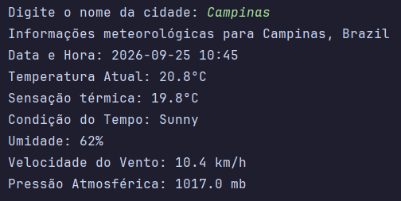

# 🌤️ Weather CLI

Uma aplicação de linha de comando (CLI) simples e eficiente em Java 21 para consulta de informações meteorológicas em tempo real.





---

## 📌 Sobre o Projeto

O **Weather CLI** é um projeto desenvolvido para consultar dados de clima diretamente pelo terminal. A aplicação consome uma API REST de meteorologia, faz o parse de dados JSON usando a biblioteca `org.json` e gerencia chaves secretas com suporte a variáveis de ambiente via `dotenv-java`.

### 🛠️ Tecnologias Utilizadas
- **Java 21 LTS**
- **[org.json](https://github.com/stleary/JSON-java)** — Para manipulação de respostas JSON
- **[dotenv-java](https://github.com/cdimascio/dotenv-java)** — Para gerenciamento de variáveis de ambiente (`.env`)
- **IntelliJ IDEA**

---

## 🚀 Como Executar o Projeto

### Pré-requisitos
- **Java JDK 21** instalado na máquina.
- Git instalado para clonar o repositório.

### 1. Clonar o Repositório
```bash
git clone [https://github.com/seu-usuario/weather-cli.git](https://github.com/seu-usuario/weather-cli.git)
cd weather-cli
```

### 2. Configurar as Variáveis de Ambiente

Crie um arquivo .env na raiz do projeto baseado no modelo .env.example:

```bash
cp .env.example .env
```

Abra o arquivo .env gerado e adicione a sua chave de API:

```bash
API_KEY=sua_chave_aqui
```

### 3. Compilar e Executar
Via IntelliJ IDEA:

- Abra a pasta do projeto no IntelliJ IDEA.
- Certifique-se de que a pasta lib/ está reconhecida como biblioteca (Project Structure > Libraries).
- Execute a classe principal Main.java.
  
Via Linha de Comando (Terminal):
```bash
# Compilar o código informando as bibliotecas da pasta lib
javac -cp "lib/*" -d out src/Main.java

# Executar a aplicação
# No Linux / macOS:
java -cp "lib/*:out" Main

# No Windows (PowerShell / CMD):
java -cp "lib/*;out" Main
```

### 💻 Exemplo de Uso

Ao executar o projeto, informe o nome da cidade desejada:

```Plaintext
> Digite o nome da cidade: Campinas
Informações meteorologicas para Campinas, Brazil
Data e Hora: 2026-09-25 10:15
Temperatura Atual: 20.8°C
Sensação termica: 19.8°C
Condição do Tempo: Sunny
Umidade: 62%
Valocidade do Vento: 10.4 km/h
Pressao Atmosférica: 1017.0 mb
```


